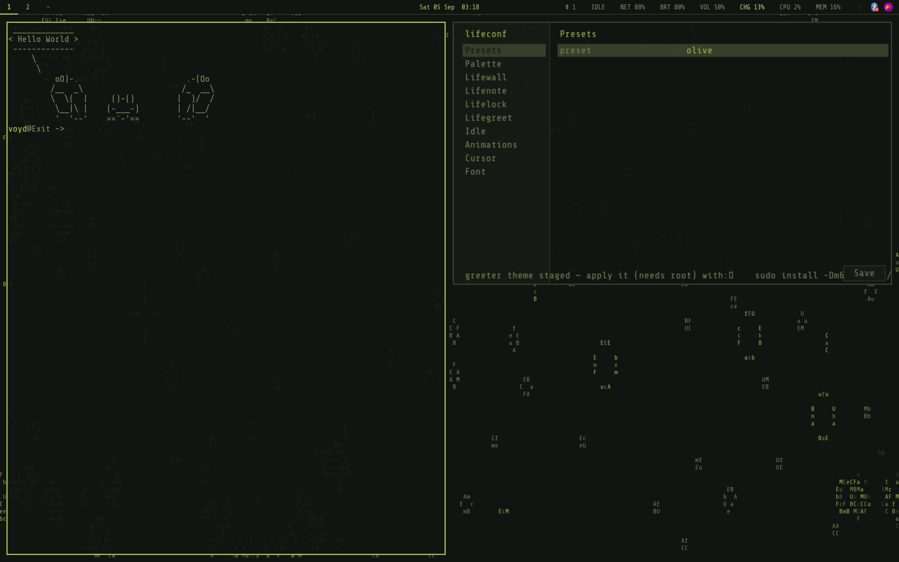
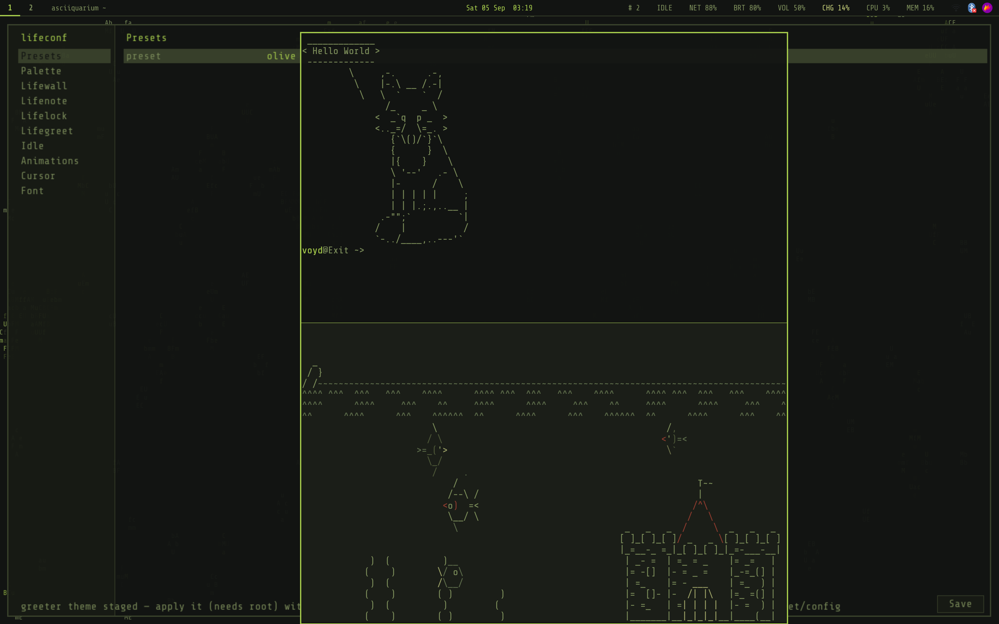
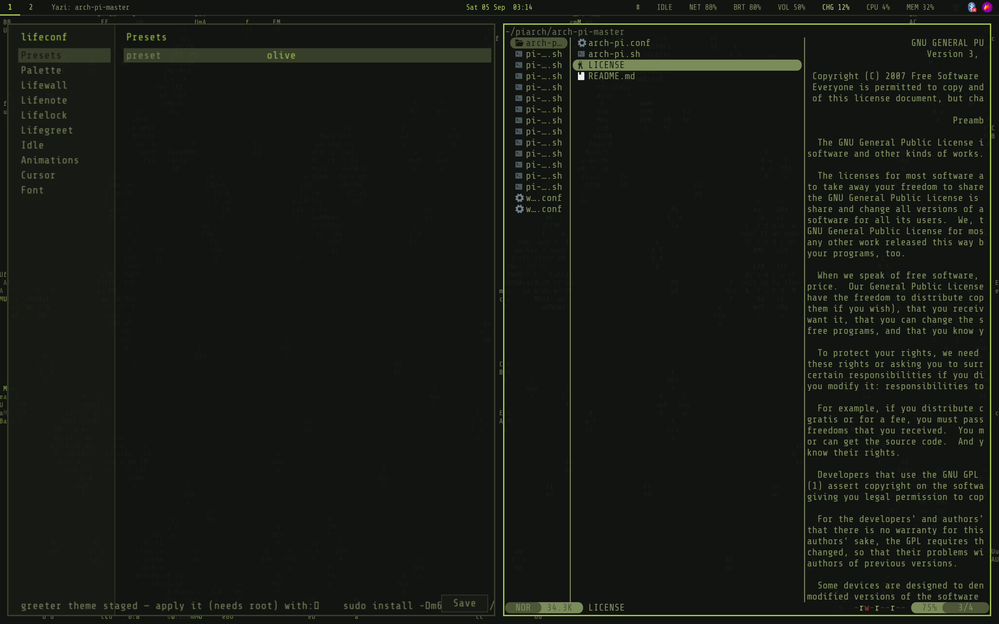
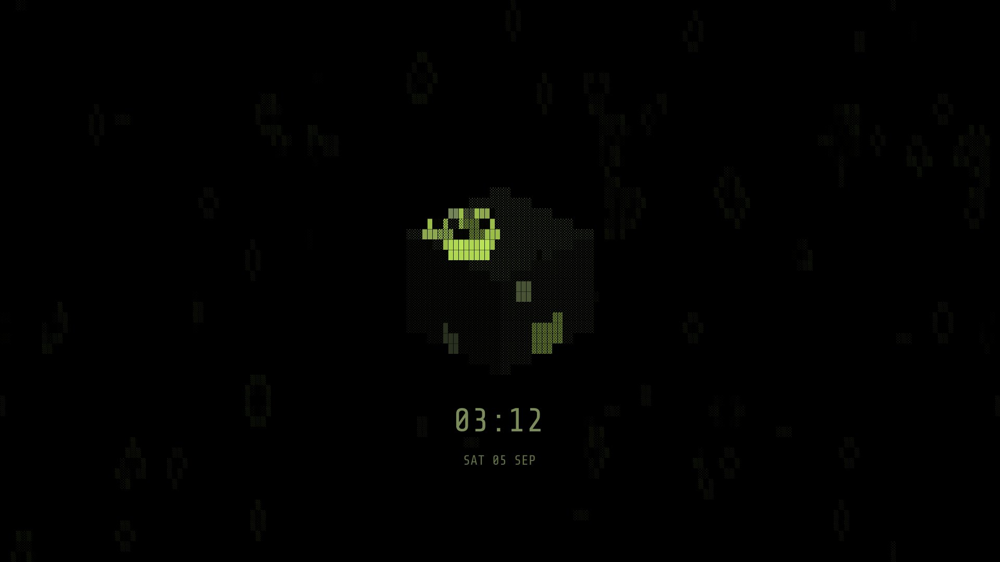

# LifeBranch

A [niri](https://yalter.github.io/niri/) desktop for Arch Linux, built around
Conway's Game of Life and a muted olive palette. Pure text, no icon fonts. The
wallpaper, lock screen and login screen are all the same cellular automaton,
and one config file re-themes every part of it.


| | |
|---|---|
|  |  |
| Tiled columns, the bar, the wallpaper behind them | Floating windows stacked over the layout |
|  |  |
| A file manager and the theming TUI side by side | lifelock; lifegreet is its twin |

Rust components, built from source by the installer:

| | |
|---|---|
| [`lifeconf`](lifeconf/README.md) | theming front-end: one `theme.toml` regenerates every consumer's config |
| [`lifewall`](lifewall/README.md) | the Game of Life wallpaper |
| [`lifelock`](lifelock/README.md) | screen locker, PAM-backed |
| [`lifenote`](lifenote/README.md) | notification daemon |
| [`lifegreet`](lifegreet/README.md) | login screen |
| [`lifefiles`](lifefiles/README.md) | mouse-driven terminal file browser |
| [`lifeshot`](lifeshot/README.md) | screenshot + annotation overlay |
| [`lifemenu`](lifemenu/README.md) | launcher + dmenu (fuzzel-compatible flags; the scripts' menus) |
| [`lifeauth`](lifeauth/README.md) | credentials agent: polkit passwords, Bluetooth pairing codes, network secrets (asks through lifemenu) |
| [`lifebar`](lifebar/README.md) | status bar: workspaces, clock, readings, text tray (replaces waybar) |
| [`lifeportal`](lifeportal/README.md) | file-chooser portal: apps' Open/Save dialogs are lifefiles |
| [`lifeosd`](lifeosd/README.md) | volume/brightness on-screen bar (replaces wob) |
| [`lifecursor`](lifecursor/README.md) | cursor themes LifeBranch-dark and -light, outlined for any background |
| [`lifepanel`](lifepanel/README.md) | quick settings: wifi, bluetooth, sound, brightness, power, drives; USB automount |
| [`lifefont`](lifefont/README.md) | shared glyph rasterizer (library; lazy, ~37 MB less per process than fontdue) |

## Install

Arch Linux or a derivative, x86_64 or aarch64. Nothing here needs an existing
desktop environment.

```sh
curl -fsSL https://raw.githubusercontent.com/TheWhyteWolf/LifeBranch/main/bootstrap.sh | bash
```

Read it before running it if you prefer:

```sh
curl -fsSL https://raw.githubusercontent.com/TheWhyteWolf/LifeBranch/main/bootstrap.sh -o lifebranch.sh
less lifebranch.sh
bash lifebranch.sh
```

Or by hand:

```sh
git clone https://github.com/TheWhyteWolf/LifeBranch.git ~/LifeBranch
bash ~/LifeBranch/install.sh
```

`bootstrap.sh` installs git, clones to `~/LifeBranch` and runs `install.sh`,
handing it your terminal so the installer's questions still reach you through a
`curl | bash` pipe.

Beyond a base Arch install this needs `sudo`, with your user in the `wheel`
group and the `%wheel` line uncommented in `/etc/sudoers`. `bootstrap.sh` checks
that before it does anything else and prints the three commands that fix it.
Every run is written to `~/lifebranch-install.log` (`LIFEBRANCH_LOG=none` to
turn that off), so if something stops halfway the log says where.

Updating an existing install is `git -C ~/LifeBranch pull` and then the same
`bash ~/LifeBranch/install.sh`. It is idempotent, and re-running it is also what
links any script added since you last ran it.

Your own niri settings (keyboard, touchpad, mouse, night light, and the theme
regions lifeconf writes) live in `niri/local.kdl`, which is gitignored and
included by the tracked `niri/config.kdl`, so changing them never blocks a pull.
Installs from before that split kept them in `config.kdl` itself, where `git
pull` refuses to overwrite them. Update those once with `git -C ~/LifeBranch
stash && git -C ~/LifeBranch pull` and then the installer: it creates
`local.kdl` and carries your settings over from the stash.

### Easy or full control

The installer's first question is which of the two it is:

- **Easy** takes the recommended answer to everything: your detected keyboard
  and touchpad, no extra packages, `pacman` and `yay` with `--noconfirm`.
- **Full control** asks about each step (extra packages, touchpad, keyboard
  layout, suspend policy, performance profile), which is what it always did.

Both end at the same desktop, and nothing either one decides is permanent:
re-run the installer, or change it in `lifeconf`. `LIFEBRANCH_EASY=1` (easy) or
`LIFEBRANCH_EASY=0` (full) skips the question, and a run with no terminal behind
it is always easy, since there is nobody there to answer.

The installer bootstraps `yay` if it is missing, installs the stack and the
everyday applications, detects your touchpad and keyboard layout and offers
matching settings, symlinks the configs (backing up anything already there to
`*.bak`), builds the Rust components, offers a lite profile on slow hardware,
asks before masking suspend, and validates the niri config before it finishes.

Then log out and pick **Niri**. The re-login is required, not cosmetic: the
Wayland platform variables in `~/.config/environment.d/` are only read when the
session starts (see **Native Wayland** below).

A cheat sheet of your keybinds opens once at each login, generated from your own
config so it cannot drift. `Mod+Slash` reopens it, and it says how to edit the
bindings and how to switch it off.

The login screen is a separate step, since it replaces your display manager:

```sh
bash ~/LifeBranch/greeter-install.sh
```

## MacBook variant

`macbook/` is the same setup for a 2019 MacBook Pro (T2): HiDPI `eDP-1` at
scale 2, the Apple trackpad, XF86 volume and brightness keys, battery and
backlight in the bar, and the T2 suspend/audio/Bluetooth plumbing.
`bootstrap.sh` offers it automatically on Apple hardware; by hand it is
`bash ~/LifeBranch/macbook/install.sh`. See [`macbook/README.md`](macbook/README.md).

## Palette

| Role | Hex |
|---|---|
| Background | `#121412` |
| Panel / surface | `#171a14` |
| Border / inactive | `#39412b` |
| Text | `#7b8c5a` |
| Accent / focus | `#a4c94b` |
| Warn | `#c7d17a` |
| Urgent | `#8a3b2e` |

**Pure text everywhere:** no glyph icons. lifebar uses labels (`NET`/`VOL`/`CPU`/`MEM`, tray apps by name),
notifications are lifenote's box-drawing frames, lifemenu draws no app icons, and the lifeosd OSD is a labelled text bar.

**One source of truth:** the palette above (and the Game-of-Life parameters, idle
timeouts, cursor, etc.) now live in `~/.config/lifeconf/theme.toml`. `lifeconf
--apply` regenerates every consumer's own config from it; `lifeconf --preset
olive|slate|moss` swaps palettes. See [`lifeconf/`](lifeconf/README.md).

The fully-generated consumer files (`waybar/style.css`, `fuzzel/fuzzel.ini`,
`kitty/olive.conf`, `lifenote/config`, `swaylock/config`) are **build artifacts
now — gitignored, not tracked** — so each machine can run its own preset without
dirtying the repo. After pulling the commit that untracked them, run
`lifeconf --apply` once to regenerate them locally (fresh installs get this from
install.sh). The niri configs stay tracked but hold no per-machine settings:
those are fenced regions in the gitignored `niri/local.kdl` that `config.kdl`
includes, which lifeconf and the installer rewrite in place.

## Layout

```
niri/config.kdl      -> ~/.config/niri/config.kdl (ends with `include "local.kdl"`)
niri/local.kdl       -> ~/.config/niri/local.kdl (this machine's settings; gitignored; made from local.kdl.default)
fuzzel/fuzzel.ini    -> ~/.config/fuzzel/fuzzel.ini (generated by lifeconf; gitignored; lifemenu's look)
lifenote/config      -> ~/.config/lifenote/config (generated by lifeconf; gitignored)
kitty/rice.conf      -> ~/.config/kitty/rice.conf (included from kitty.conf)
kitty/olive.conf     -> ~/.config/kitty/olive.conf (generated by lifeconf; gitignored)
swaylock/config      -> ~/.config/swaylock/config (generated by lifeconf; gitignored)
xdg/portals.conf     -> ~/.config/xdg-desktop-portal/portals.conf
qt6ct/qt6ct.conf     -> ~/.config/qt6ct/qt6ct.conf
systemd/lifebar.service -> ~/.config/systemd/user/lifebar.service (supervised lifebar)
tmpfiles/kitty.conf  -> ~/.config/user-tmpfiles.d/kitty.conf (creates $XDG_RUNTIME_DIR/kitty for listen_on)
environment.d/50-niri-platform.conf -> ~/.config/environment.d/ (Wayland platform vars)
brave/brave-flags.conf -> ~/.config/brave-flags.conf (Brave is Chromium: own flags file)
scripts/clip-menu.sh -> ~/.local/bin/clip-menu.sh
scripts/power-menu.sh    -> ~/.local/bin/power-menu.sh
scripts/lifebg-toggle.sh -> ~/.local/bin/lifebg-toggle.sh
scripts/vol-osd.sh   -> ~/.local/bin/vol-osd.sh (volume keys -> wpctl + lifeosd flash)
scripts/dnd-toggle.sh -> ~/.local/bin/dnd-toggle.sh (lifenote do-not-disturb, Mod+N)
scripts/net-menu.sh  -> ~/.local/bin/net-menu.sh (wifi menu; lifepanel does the same)
scripts/notif-menu.sh -> ~/.local/bin/notif-menu.sh (the bar's # button: notification history)
scripts/float-snap.sh -> ~/.local/bin/float-snap.sh (floating window snapping, Mod+Alt+arrows)
scripts/scratch-term.sh -> ~/.local/bin/scratch-term.sh (dropdown terminal, Mod+Grave)
scripts/rec-toggle.sh -> ~/.local/bin/rec-toggle.sh (screen-record toggle, Mod+Print)
scripts/sysmon.sh    -> ~/.local/bin/sysmon.sh (the bar's CPU/MEM click: focuses the one htop, never opens a second)
scripts/bright-osd.sh -> ~/.local/bin/bright-osd.sh (laptop only: brightness + lifeosd)
scripts/pinentry-fuzzel.sh -> ~/.local/bin/pinentry-fuzzel.sh (GPG passphrase prompts via lifemenu, else fuzzel)
scripts/shortcuts-window.sh -> ~/.local/bin/shortcuts-window.sh (the login cheat sheet, Mod+Slash)
scripts/detect-trackpad.sh -> ~/.local/bin/detect-trackpad.sh (touchpad capabilities -> niri config)
scripts/setup-locale.sh -> ~/.local/bin/setup-locale.sh (keyboard layout + timezone -> niri config)
scripts/lite-profile.sh -> ~/.local/bin/lite-profile.sh (turn the expensive parts down)
scripts/idle-suspend.sh -> ~/.local/bin/idle-suspend.sh (idle suspend, battery only)
scripts/hide-autostart.sh (installer helper: keeps nm-applet/blueman's XDG autostart out of niri, not Plasma)
scripts/ensure-yay.sh (AUR helper bootstrap; not linked — the installers call it)
scripts/packages.sh (sourced: the one package list both installers use, plus service setup)
scripts/check-deps.sh (CI: every command the code calls comes from a listed package)
scripts/config-region.sh (sourced helper: rewrite fenced LIFEBRANCH regions safely)
scripts/snapshots.sh (root: snapshot setup and restore; installed root-owned to /usr/local/lib/lifebranch for Settings > Snapshots)
scripts/test-snapshots.sh (root: restore tests on a throwaway btrfs image)
scripts/prompt.sh (sourced helper: easy mode vs full control, and every installer question)
bootstrap.sh         (curl entry point: clone + install)
lifeconf/            -> ~/.local/bin/lifeconf (rust build; the theming front-end)
lifenote/            -> ~/.local/bin/lifenote (rust build; the notification daemon)
lifefiles/           -> ~/.local/bin/lifefiles (rust build; the file browser, Mod+E)
lifeshot/            -> ~/.local/bin/lifeshot (rust build; screenshot + annotate, Shift+Print)
lifewall/            -> ~/.local/bin/lifebg (rust build)
lifelock/            -> ~/.local/bin/lifelock (rust build; the lock screen)
lifegreet/           -> /usr/local/bin/lifegreet (rust build by greeter-install.sh; the login screen)
greetd/config.toml   -> /etc/greetd/config.toml (copied by greeter-install.sh, not symlinked)
greetd/pam/greetd    -> /etc/pam.d/greetd (copied by greeter-install.sh; login + keyring unlock)
greetd/config-tuigreet.toml (fallback greeter config; install over config.toml to revert)
greetd/greetd.service.d/lifegreet.conf -> /etc/systemd/system/greetd.service.d/ (memlock + retry-forever drop-in)
```

## Key bindings (Mod = Super)

| Bind | Action |
|---|---|
| `Mod+Return` / `Mod+D` / `Mod+Space` | lifemenu launcher |
| `Mod+T` | kitty terminal |
| `Mod+Grave` | dropdown terminal (quake-style kitty in the top half) |
| `Mod+P` | clipboard history |
| `Mod+O` | overview |
| `Mod+Q` | close window |
| `Mod+H/J/K/L` / arrows | focus |
| `Mod+1..9` | workspaces |
| `Mod+V` / `Mod+Shift+V` | float window / focus float↔tiling |
| `Mod+Alt+H/J/K/L` / arrows | smart float snap: halves → quarters → max; back toward the middle restores |
| `Mod+Alt+C` / `Mod+Alt+R` | center / un-snap floating window |
| `Mod+Shift+Ctrl+H/J/K/L` / arrows | nudge floating window 40 px |
| `Mod+KP_7/9/1/3` · `KP_4/6/8/2` · `KP_5` | float straight to corner · half · center (desktop numpad) |
| `Mod+KP_Add/Subtract/Multiply` | volume up / down / mute (OSD flash) |
| `Mod+KP_Divide` | media play/pause (playerctl) |
| `Mod+N` | do-not-disturb toggle (lifenote + the bar's DND label) |
| `Mod+E` | file manager (lifefiles, in kitty) |
| `Shift+Print` | screenshot + annotate (lifeshot); `Print`/`Ctrl+Print`/`Alt+Print` are niri's own |
| `Mod+S` | settings (lifeconf GUI) |
| `Mod+A` | quick settings (lifepanel) |
| `Mod+Alt+Escape` | lock screen (moved from `Mod+Alt+L` for the snap mirror) |
| `Mod+Shift+E` | power menu |
| `Mod+Shift+G` | pause/resume wallpaper |
| `Mod+Ctrl+G` | reset wallpaper (fresh soup) |
| `Print` / `Ctrl+Print` / `Alt+Print` | screenshot area / screen / window |
| `Mod+Print` | screen-record toggle (wf-recorder → ~/Videos) |
| `Ctrl+Alt+Return`/`Space`/`O`/`Q` | non-Super fallbacks (kitty/lifemenu/overview/close) |
| `Mod+Slash` | the LifeBranch cheat sheet (this table, generated from your config) |

`Mod+Shift+/` shows niri's own hotkey overlay. `Mod+Slash` shows LifeBranch's,
which is parsed out of your live `config.kdl` — rebind something and it says so
next time you open it.

## Rice

- **Theming front-end** — [`lifeconf/`](lifeconf/README.md) (rust, built by
  install.sh) turns one `~/.config/lifeconf/theme.toml` into every consumer's
  native config: waybar `@define-color` roles, kitty's 16-colour palette,
  fuzzel/lifenote/swaylock/lifelock colours, the greeter (staged for a manual
  `sudo install`), and niri's fenced regions (animation slowdown, cursor, idle
  timeouts, lifewall flags). Run `lifeconf` for the interactive UI — a
  keyboard-driven TUI in a terminal (kitten-themes style: colours re-theme live
  as you move), or a matching olive **GUI** (`lifeconf --gui`) with mouse
  support — or headless: `lifeconf --apply` regenerates everything, `--preset
  olive|slate|moss` swaps palettes. Live-apply pushes colours to waybar/kitty/
  lifenote instantly and respawns the wallpaper/idle on commit; the lock/login
  screens (lifelock/lifegreet) can follow the palette or carry their own colours.
- **Game of Life wallpaper** — [`lifewall/`](lifewall/README.md) (rust,
  built by install.sh) draws itself on niri's background layer, on the GPU
  (`lifebg --layer`; about a third of the CPU the old kitty panel took), as
  random printable ASCII: muted olive cells (`#66744c`), newborn
  flashes (`#87a540`), and 15 fps colour interpolation — births fade in,
  deaths dissolve, generations tick every 0.3s. Auto-reseeds (crossfade)
  when the board settles or nearly dies. It drops to 8 fps on battery
  (`--fps-battery`, read straight off `/sys/class/power_supply`), because the
  frame rate is where essentially all of its cost lives — see
  [lifewall's Cost section](lifewall/README.md#cost) for the measurements.
  Flags: `lifebg --help`.
  Kill/restart: `pkill -f '[l]ifebg'`, then re-run the lifebg line from
  `niri/local.kdl` (or `lifeconf --apply`). The stdlib Python original,
  `scripts/life.py` (discrete 3-frame fades, run inside a kitty panel), is
  still in the repo but no longer installed.
- **Kitty transparency + olive** — `kitty/rice.conf` sets `background_opacity
  0.93` so the Life board ghosts through terminals, and includes
  `kitty/olive.conf` — the full olive 16-colour palette (`include rice.conf`
  is appended to `~/.config/kitty/kitty.conf` by install.sh).
- **Volume OSD** — the volume keys go through `vol-osd.sh`: wpctl plus a
  [`lifeosd`](lifeosd/README.md) flash (`volume ████░░░ 45%`, bottom-centre).
  The keys stay
  `allow-when-locked`; the bar can't draw over the lock surface, but the
  audio still changes.
- **Notifications** — [`lifenote/`](lifenote/README.md) (rust, built by
  install.sh) replaced mako: pure-text popups in box-drawing frames, top
  right, olive. Style/colours/alpha live in `lifenote/config` (border-style
  `single|rounded|heavy|double|ascii`). The bar's `#` button shows `# N`
  while N notifications came and went unseen (expired or DND-swallowed) and
  opens the history — the last 50 — in a lifemenu list; `lifenote ctl history`
  prints the same in a terminal.
- **Do-not-disturb** — `Mod+N` (or clicking the red `DND` label in the bar)
  toggles lifenote's do-not-disturb mode; swallowed notifications land
  silently in the history, counted on the `#` badge.
- **Float snapping** — `Mod+Alt+arrows` (or `H/J/K/L`) snap the focused
  window Windows-style (`float-snap.sh`): first press takes a half, a second
  along the other axis refines to a quarter, `up` from the top half maximizes
  — always with 12px margins matching the tiling gaps. Pressing back toward
  the middle steps out and finally **restores the pre-snap geometry**; tiled
  windows auto-float on the first snap and return to the tiling layout on
  restore. `Mod+Alt+C` centers, `Mod+Alt+R` un-snaps,
  `Mod+Shift+Ctrl+arrows/HJKL` nudge 40 px, and the desktop numpad jumps
  straight to a zone (`Mod+KP_7/9/1/3` corners, `KP_4/6/8/2` halves, `KP_5`
  center — both NumLock states bound). Free mouse control is niri built-in:
  `Mod+drag` moves, `Mod+right-drag` resizes. Firefox picture-in-picture
  docks bottom-right; pavucontrol/blueman/nm-connection-editor open floating
  at 720×540 via window rules.
- **Dropdown terminal** — `Mod+Grave` toggles a persistent floating kitty
  (`scratch-term.sh`) pinned to the top half: press to summon it onto the
  current workspace, again to stash it away (it parks on the trailing empty
  workspace — deliberately not a named workspace, which would sort first and
  steal `Mod+1`). If it's visible but unfocused, `Mod+Grave` focuses it.
- **DE plumbing** — the invisible bits a full DE ships: lifeauth
  (GUI privilege prompts — without one GParted/Dolphin-mounts fail silently),
  wlsunset night light (location and temperatures in Settings > Night light), `lifepanel --watch` USB
  automount (mount events arrive as lifenote popups), a caffeine toggle in the bar (IDLE
  label → click → warn-tinted WAKE holds off the idle lock), `Mod+Print`
  wf-recorder screen capture, and `Mod+KP_Divide` media play/pause
  (playerctl, MPRIS).
- **GPG passphrase prompts** (opt-in, off by default) —
  `scripts/pinentry-fuzzel.sh` is an Assuan pinentry that prompts through
  fuzzel (`--password --prompt-only`), so unlocking a key looks like every
  other menu here and inherits the palette from the lifeconf-generated
  `fuzzel.ini`. Otherwise the stock `/usr/bin/pinentry` wrapper picks
  `pinentry-gnome3` under niri (`XDG_CURRENT_DESKTOP=niri` hits the `*` branch
  of its backend guess) and draws a light Adwaita dialog.

  **install.sh links it but does not enable it, on purpose.** fuzzel takes an
  *exclusive* layer-shell keyboard grab, so a prompt that wedges takes the
  entire session's input with it — no keybinds, no way to close it, only
  `Ctrl+Alt+F3` to a TTY. Three things guard against that, all load-bearing:
  every fuzzel call redirects `</dev/null` (the script's own stdin is the
  Assuan pipe from gpg-agent, and fuzzel would otherwise eat the protocol
  stream); every call is wrapped in `timeout -k 5 $PIN_TIMEOUT` so a grab can
  never outlive the prompt; and every `--only-match` box is fed a dummy entry,
  because fuzzel documents `--only-match` as *not returning* when nothing
  matches — an OK box with no entries could not be dismissed with Enter and
  would hold the grab for the full timeout. An early revision missing the first
  of those locked the machine up hard.

  **Off the desktop it hands over to a terminal pinentry.** Naming a script in
  `pinentry-program` replaces `/usr/bin/pinentry`'s whole backend chain, so
  without a fallback every `git commit -S` over SSH or on a TTY would fail with
  a misleading "Operation cancelled". With no `WAYLAND_DISPLAY` the script
  `exec`s `pinentry-curses`, inheriting the Assuan pipe.

  Test it standalone before enabling — never enable an untested pinentry, since
  a broken one stands between you and every key operation:

  ```sh
  printf 'SETDESC test\nSETPROMPT Passphrase\nGETPIN\nBYE\n' \
    | ~/.local/bin/pinentry-fuzzel.sh > /dev/null
  ```

  `>/dev/null` matters: the raw protocol echoes what you type. Have
  `Ctrl+Alt+F3` ready the first time. Enable with a `pinentry-program` line in
  `~/.gnupg/gpg-agent.conf`; back out by deleting it and running
  `gpgconf --kill gpg-agent`.

  **Trade-off, with a switch for it:** a passphrase box identical to the
  launcher is spoofable by anything that can exec fuzzel. Drop a fuzzel config
  at `~/.config/fuzzel/pinentry.ini` (an urgent-red border, say) and passphrase
  prompts use it while the launcher keeps the normal theme. Only that exact
  path is honoured, and the fuzzel binary is resolved inside the script rather
  than taken from the environment: gpg-agent hands its pinentry the whole
  inherited environment, so an overridable program name would be an
  arbitrary-command exec in front of every passphrase.

  If you would rather not run a hand-written Assuan implementation,
  `pinentry-program /usr/bin/pinentry-qt` gets most of the way there. Qt is
  already themed here through `qt6ct/qt6ct.conf`, and pinentry-qt takes no
  exclusive keyboard grab.
- **Supervised bar** — the bar runs as a systemd user unit
  (`systemd/lifebar.service`, `WantedBy=graphical-session.target`), not from niri's
  `spawn-at-startup`. A spawned process is a one-shot scope: when the bar
  exits the bar is simply gone until you notice, and its stderr is discarded so
  nothing is left to diagnose. The unit restarts it (`Restart=always`,
  `StartLimitIntervalSec=0` — a bar must come back forever) and journals it.
  `journalctl --user -u lifebar -b` to read it, `systemctl --user reload lifebar`
  to poke SIGUSR2 by hand.

  **Why it exists:** waybar has been seen to die and stay dead. A
  coredump put the SIGSEGV inside `libgdk-3` dispatching a Wayland output event
  — plausibly from a phantom connector the GPU reports as connected with no
  EDID — but the link was never proven. The unit makes the symptom self-healing
  either way, and the journal keeps the evidence. Full notes are in
  [`systemd/waybar.service`](systemd/waybar.service).
- **Keyboard cheat sheet** — `scripts/shortcuts-window.sh` opens a framed list
  of every binding at login and on `Mod+Slash`. It is parsed out of your live
  `config.kdl` rather than kept in a table beside it, so it cannot drift. Binds
  that do the same thing share a row, `hotkey-overlay-title=null` binds stay
  hidden, and the footer names the command to edit the config. One line in that
  config turns it off.
- **Touchpad detection** — `scripts/detect-trackpad.sh` reads the capability
  bitmasks from sysfs (no root, no session): multitouch protocol, finger count,
  clickpad or physical buttons, size. `--niri-block` turns that into a
  `touchpad { ... }` block: `clickfinger` on Apple hardware, `button-areas`
  elsewhere, two-finger scrolling only if the hardware does it. The installer
  writes it into the fenced `LIFEBRANCH:BEGIN touchpad` region of
  `niri/local.kdl`, validates the
  result, and restores the previous file if it does not parse.
- **Dim unfocused** — window rule drops unfocused windows to 95% opacity.
- **Snappier animations** — `animations { slowdown 0.6 }`.
- **GTK dark + cursor** — `adw-gtk3-dark`, prefer-dark colour scheme, and
  `LifeBranch-dark`, our own cursor theme from [`lifecursor`](lifecursor/README.md)
  (set for niri in `cursor {}` and for GTK via gsettings in install.sh).
- **Unified font** — ShureTechMono Nerd Font (`ttf-sharetech-mono-nerd`;
  Nerd Fonts renames Share Tech Mono → "ShureTech" because OFL reserves the
  original name) across waybar, fuzzel, mako, kitty (via rice.conf),
  swaylock, lifelock, lifegreet, and the wallpaper panel. Share Tech Mono
  ships Regular only, so bold/italic are synthesized; Cousine Nerd Font
  stays installed as the fallback chain's second entry.
- **Screen lock, never sleep** — [`lifelock/`](lifelock/README.md) (the Game
  of Life cube locker) + swayidle: lock at 10 min idle, screens off at 15 min,
  `Mod+Alt+Escape` locks on demand; swaylock stays installed as the emergency
  fallback (`Mod+Shift+Alt+Escape`). The lock shows clock + date, counts failed
  attempts in rust red, and carries a frame-callback watchdog so a monitor
  that drops its HDMI connector waking from deep standby can no longer freeze
  it. That watchdog backs off (250 ms, doubling to 4 s) while nothing answers,
  since a powered-off monitor looks exactly like a lost callback from inside
  the locker and repainting a full screen four times a second all night is not
  free; a keypress or a real frame callback snaps it back to 250 ms.
  The desktop this grew up on runs live services and masks
  `sleep/suspend/hibernate/hybrid-sleep.target` system-wide — but that is a
  policy, not a default: install.sh detects a battery and leaves suspend alone
  on laptops, and asks before masking anything on a desktop. On a laptop it
  also offers a fourth idle step — suspend after 30 min — which
  `scripts/idle-suspend.sh` then applies only while actually discharging
  (`lifeconf` → Idle → `suspend_minutes`; 0 is off, and is the default).
- **Power menu** — `Mod+Shift+E` opens a fuzzel menu (Lock / Log out /
  Reboot / Power off). A Suspend entry appears only on machines where
  `sleep.target` isn't masked, so it shows up on a laptop and not on a
  never-sleep desktop. `Ctrl+Alt+Delete` remains the raw quit fallback.
- **Wallpaper pause/reset** — `Mod+Shift+G` freezes/resumes the Game of Life
  (SIGSTOP/SIGCONT; zero CPU while frozen, lifewall resyncs on resume);
  `Mod+Ctrl+G` resets it — SIGUSR1 triggers a crossfade into a fresh soup.
- **Portals** — file dialogs via [`lifeportal`](lifeportal/README.md)
  (lifefiles as the picker; `-gtk` until it's built), settings via `-gtk`,
  screencast/screenshot via `-gnome` (`xdg/portals.conf`), so screen sharing
  works on niri.
- **Qt dark** — `QT_QPA_PLATFORMTHEME=qt6ct` with Fusion + darker palette
  (`qt6ct/qt6ct.conf`). Set in niri's `environment {}` block, so it is
  niri-only — a Plasma session keeps its own theme.
- **Native Wayland (drag-and-drop)** — xwayland-satellite cannot bridge
  drag-and-drop across the X11/Wayland boundary
  ([#133](https://github.com/Supreeeme/xwayland-satellite/issues/133)), so a
  drag only lands when source and target sit on the *same* side. Qt, Electron
  and Brave are therefore pinned to native Wayland:
  `environment.d/50-niri-platform.conf` carries `QT_QPA_PLATFORM=wayland;xcb`,
  `QT_WAYLAND_DISABLE_WINDOWDECORATION=1` (companion to `prefer-no-csd`, since
  a Wayland Qt app would otherwise draw its own titlebar) and
  `ELECTRON_OZONE_PLATFORM_HINT=auto`; Brave ignores that last one — it is
  Chromium, not Electron — and gets `--ozone-platform-hint=auto` from
  `brave/brave-flags.conf`. The platform plugins (`qt6-wayland`,
  `qt5-wayland`) are the real fix and are in `PKGS`; without them Qt just falls
  back to xcb.

  It lives in `environment.d/` rather than niri's `environment {}` block on
  purpose: that block only reaches processes niri spawns, so Dolphin opened via
  a portal or D-Bus activation would have stayed on XWayland while the same
  Dolphin opened from fuzzel was a Wayland client. A `spawn-at-startup` line
  runs `dbus-update-activation-environment` to cover the D-Bus services that
  still carry no `SystemdService=`. **Changes need a re-login** — the systemd
  user manager reads `environment.d` at session start.

  **The trade-off is real and deliberate.** X11-only apps are now on the far
  side of the boundary from the file manager: dragging a sample from Dolphin
  into **Bitwig Studio** used to work (both were quietly on the one Xwayland
  server) and no longer does. Dolphin → Brave / vesktop / VS Code works
  instead. Both directions are not available at once. To go back for one app,
  drop `--ozone-platform=x11` into `~/.config/vesktop-flags.conf` or
  `code-flags.conf`; to go back wholesale, remove the symlinked
  `~/.config/environment.d/50-niri-platform.conf` and re-login. vesktop's
  push-to-talk on Wayland needs your user in the `input` group — there is no
  X11-style global key grab.
- **Login screen** — greetd + [`lifegreet/`](lifegreet/README.md) under the
  `cage` kiosk compositor (`greetd/config.toml` + the
  `greetd.service.d/lifegreet.conf` drop-in — `LimitMEMLOCK=infinity` for the
  mlockall'd greeter and no start limit, both installed by
  `greeter-install.sh`, which builds the binary and swaps out the previous
  display manager). The login screen IS the lock screen: an olive username box
  (typed visibly, required every login — no remember, by design) that the Game
  of Life cube grows out of; the password shows nothing but panel flares, a
  wrong one flashes rust and collapses back to the box. `F3` picks
  the session, `Ctrl+Alt+Del` reboots (no suspend/shutdown key, in keeping
  with never-sleep). tuigreet stays installed as the fallback
  (`greetd/config-tuigreet.toml`); rollback from a TTY:
  `sudo systemctl disable greetd && sudo systemctl enable <your old DM> && reboot`.

  **Keyring unlock.** greetd's PAM stack (`greetd/pam/greetd` ->
  `/etc/pam.d/greetd`) carries the three `pam_gnome_keyring` lines Arch ships in
  `/etc/pam.d/sddm`, so logging in unlocks the login keyring and Brave, Element
  and Kleopatra stop prompting for it. Ordering is load-bearing: `-auth` goes
  *after* `auth include`, because pam_unix is what stores the password that
  pam_gnome_keyring reads — reversed, the journal shows `gkr-pam: no password
  is available for user` and the keyring stays locked.

  **The live stack is never the thing under test.** `greeter-install.sh` stages
  the new file under a scratch service name, authenticates against *that* with
  `pamtester`, and only promotes it to `/etc/pam.d/greetd` once it answers — so
  a typo cannot take your login screen with it, and there is no rollback path
  to get wrong. Doing it by hand:

  ```sh
  sudo install -Dm644 greetd/pam/greetd /etc/pam.d/greetd-verify
  sudo pamtester greetd-verify "$(id -un)" authenticate acct_mgmt
  sudo install -Dm644 greetd/pam/greetd /etc/pam.d/greetd   # only if that passed
  sudo rm /etc/pam.d/greetd-verify
  ```

  `open_session`/`close_session` are deliberately not tested: they do not
  simulate a session, they really run pam_gnome_keyring's `auto_start`.

  **Check your TTY rescue works before you need it.** `Ctrl+Alt+F3` is the
  assumed way back in, but on a T2 MacBook the console switches while the
  internal keyboard stays dead there (it needs `apple-bce`), leaving no local
  way in. Open an SSH session from another machine before rebooting into any
  greeter or PAM change.

## Notes

- **xwayland-satellite** is auto-managed by niri 26.04 once installed — no manual spawn.
- **Super-key diagnostic:** if Super seems dead, open a terminal with `Ctrl+Alt+Return`,
  run `wev`, and press the Left Windows key — you should see `sym Super_L` and `Mod4`.
- Screen lock: lifelock/swayidle, armed at session start. Suspend policy is a
  choice, not a default: install.sh leaves sleep alone on anything with a
  battery and asks before masking it on a desktop.

## License

Copyright (C) 2026 Whyte Erminae

GPL-3.0-or-later. See [LICENSE](LICENSE). Every source file carries
`SPDX-License-Identifier: GPL-3.0-or-later`. `lifelock` and `lifegreet` include
logic ported from the MIT-licensed swaylock; its notice is retained in
[`lifelock/NOTICE`](lifelock/NOTICE) and [`lifegreet/NOTICE`](lifegreet/NOTICE).

Contributions go out under the same licence. See
[CONTRIBUTING.md](CONTRIBUTING.md).
